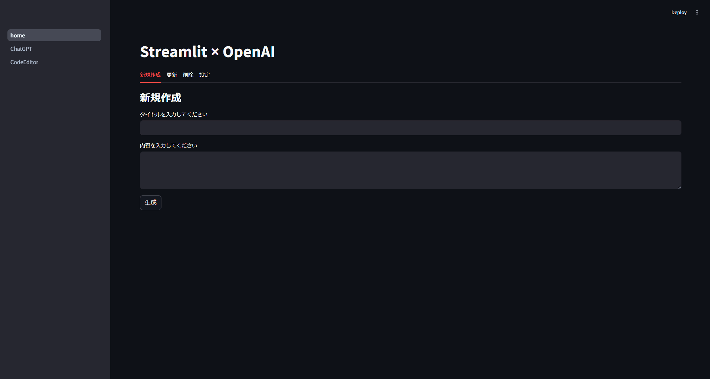

# Streamlit アプリケーション

このプロジェクトは、StreamlitとOpenAIを使用したアプリケーションです。



## 実行方法

### 前提条件

- Python 3.9がインストールされていること
- pipがインストールされていること

### 手順

1. リポジトリをクローンします。

    ```sh
    git clone https://github.com/Nara-Ryusei/streamlit.git
    cd streamlit
    ```

2. 仮想環境を作成して有効化します（任意）。

    ```sh
    python -m venv venv
    source venv/bin/activate  # Windowsの場合は `venv\Scripts\activate`
    ```

3. 必要なパッケージをインストールします。

    ```sh
    pip install -r requirements.txt
    ```

4. アプリケーションを起動します。

    ```sh
    streamlit run home.py
    ```

5. ブラウザで以下のURLにアクセスします。

    ```
    http://localhost:8501
    ```

これで、Streamlitアプリケーションが動作するはずです。

## 使用方法

1. **設定タブ**からOpenAIのAPI Keyを設定します。
2. **新規作成タブ**から新しく作成したいアプリのタイトルと内容を記入し、生成ボタンを押下します。
3. 生成が完了するとサイドバーに作成したアプリが表示されます。
4. **更新タブ**から作成したアプリを更新することができます。
5. **削除タブ**から作成したアプリを削除することができます。
